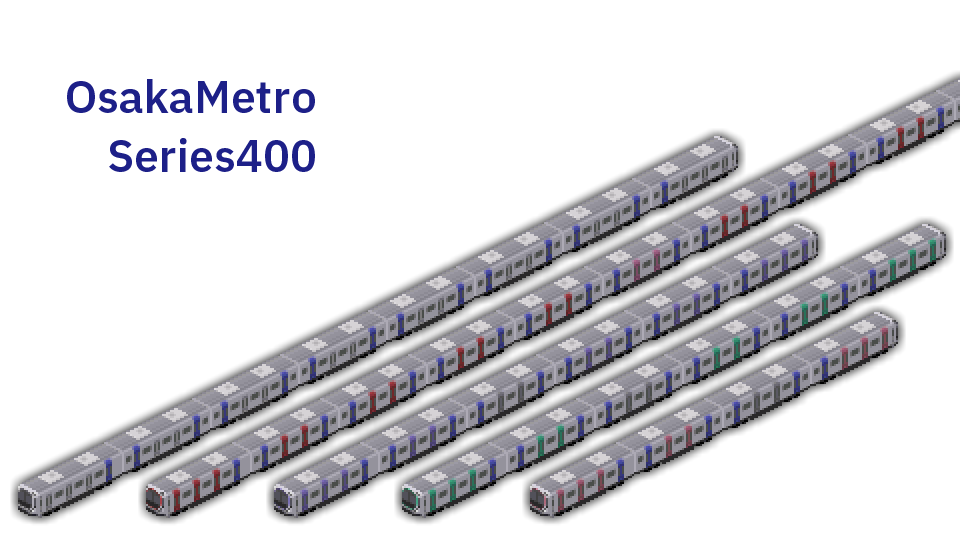

# 大阪メトロ400系 Ver1.2

作者:G_alumi [https://twitter.com/G_alumi](https://twitter.com/G_alumi)  
対応バージョン:Ver 121.0 and higher

**きたきゅー様やPak128.Japan公式のソースなどをお借りしました。ありがとうございます。**

先日発表された大阪メトロの400系です。30000系の性能をベースに設定しています。無塗装・御堂筋・谷町・四ツ橋・中央・千日前のバリエーションを10両編成ベースで用意しています。
|両数|組成|
|-----|-----|
| 10両 | 1-2-3-4-5-6-7-8-9-10 |
| 8両 | 1-2-3-4-7-8-9-10 |
| 6両 | 1-2-3-4-5-10 |
| 4両 | 1-2-3-10 |

>更新履歴  
>Ver1.2 車椅子スペースやクロスシート車のドアを修正・御堂筋線6号車に女性専用車両を追加

> 改造等につきましてはご自由に行ってください。公開の際はReadMeでいいですのでG_alumiの名前を入れていただけるとありがたいです。