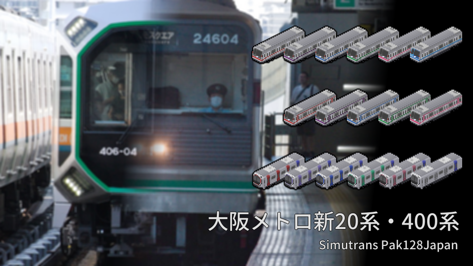

# 大阪メトロ新20/400系セット

作者: G_alumi [https://twitter.com/G_alumi](https://twitter.com/G_alumi)  
対応バージョン: Ver 121.0 and higher  
License: CC BY-NC-SA

**きたきゅー様やPak128.Japan公式のソースなどをお借りしました。ありがとうございます。**

大阪メトロの最新型・400系と広く活躍している新20系のアドオンでです。各アドオン10両編成まで組成することが出来、400系に関しては中央線以外の第三軌条線区と無地を同梱しています。  
(今まで大阪メトロ400系単独で公開していたものと同じです。)

|両数|組成|
|-----|-----|
| 10両 | 1-2-3-4-5-6-7-8-9-10 |
| 8両 | 1-2-3-4-7-8-9-10 |
| 6両 | 1-2-3-4-5-10 |
| 4両 | 1-2-3-10 |

(400系のみ、新20系は路線によってアドオン末尾の号車番号を振りなおしていますので10両編成は御堂筋線を参考に組成してください。)

女性専用車は実装しようと思ってだるくてやめました。  
御堂筋線6号車相当の画像は各ソース4行目になりますので、必要に応じて改造なりしてください。